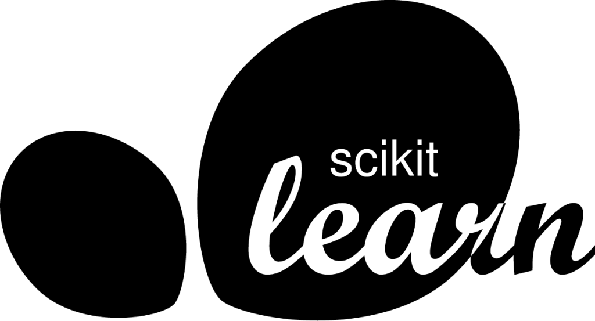

## Hi there 👋
My name is Francesco Finn. I'm a graduate from McGill University 🍁 Computer Science, and have professional experience in Full-Stack/AI-Systems Development.
I love playing the drums and going to the gym. 

  
  &nbsp;&nbsp;&nbsp;&nbsp;&nbsp;
  

\n

Here are some cool icons that represent things I use sometimes:

### Tech 🖥️

  
  &nbsp;
  
  &nbsp;
  
  &nbsp;
  
  &nbsp;
  
  &nbsp;
  
  &nbsp;
  
  &nbsp;
  
  &nbsp;
  
  &nbsp;
  
  &nbsp;
  
  &nbsp;
  
  &nbsp;
   
  &nbsp;
  
  &nbsp;
   
  &nbsp;
   
  &nbsp;
   
  &nbsp;
   
  &nbsp;
   
  &nbsp;

### Get in touch 🤝

  
  
  

